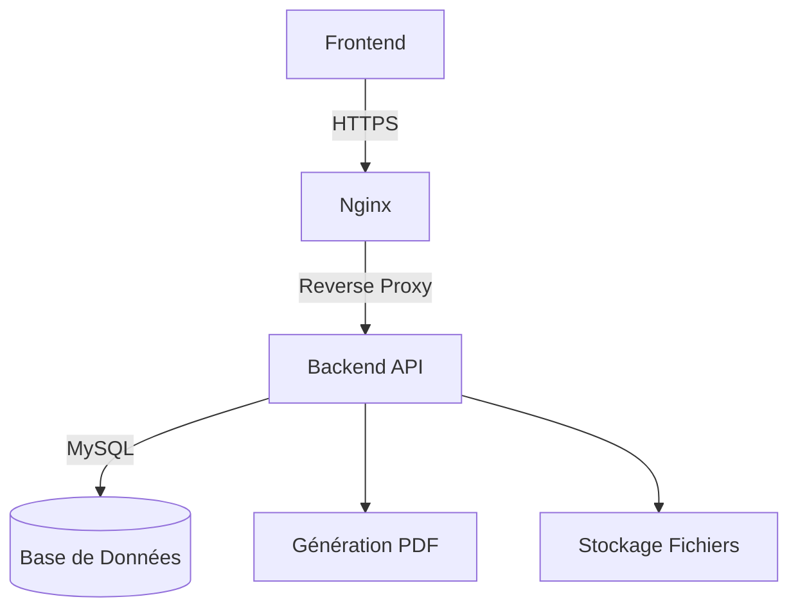

# README - Plateforme de Gestion Éducative Saint Jean Ingénieur

## 📝 Table des Matières
- [🌟 Aperçu](#-aperçu)
- [🚀 Démarrage Rapide](#-démarrage-rapide)
- [🏗 Architecture Technique](#-architecture-technique)
- [👨🎓 Fonctionnalités par Rôle](#-fonctionnalités-par-rôle)
- [🔧 Structure Technique](#-structure-technique)
- [⚙️ Déploiement](#️-déploiement)
- [🔒 Sécurité](#-sécurité)
- [📊 Gestion des Données](#-gestion-des-données)
- [🛠 Développement](#-développement)
- [📄 Licence](#-licence)

## 🌟 Aperçu
Une plateforme complète de gestion académique offrant :
- 📅 Gestion des emplois du temps
- 📝 Saisie et consultation des notes
- 📊 Génération de rapports PDF
- 👥 Administration centralisée
- 🔄 Synchronisation des données en temps réel

**Rôles disponibles** :
- Étudiant : Consulte notes/emploi du temps
- Enseignant : Gère cours/notes
- Administrateur : Supervise l'ensemble

## 🚀 Démarrage Rapide

### Prérequis
- Docker 20.10+
- Docker Compose 2.5+
- Node.js 16+

### Installation
```bash
git clone https://github.com/votre-repo/educational-platform.git
cd educational-platform

# Build et lancement des conteneurs
docker-compose up --build -d

# Initialisation de la base de données
chmod +x setup.sh
./setup.sh
```

### Configuration
Fichier `.env` :
```ini
DB_HOST=mysql
DB_PORT=3306
DB_USER=academy
DB_PASSWORD=securepassword
DB_NAME=academy_db
JWT_SECRET=votre_secret_secure
```

## 🏗 Architecture Technique



**Stack Technique** :
- Frontend : Bootstrap 5 + Vanilla JS
- Backend : Python 3.9 + Flask
- Base de données : MySQL 8.0
- Cache : Redis 6.2
- Serveur : Nginx 1.21

## 👨🎓 Fonctionnalités par Rôle

### Étudiant
- 📊 Tableau de bord personnel
- 📚 Consultation des notes par matière
- 🗓 Emploi du temps interactif
- 📥 Génération de bulletin PDF
- 📈 Statistiques de performance

### Enseignant
- 📝 Saisie des notes (manuel/CSV)
- 👨🏫 Gestion des matières attribuées
- 📅 Planification des cours
- 📦 Export des données de classe
- 📤 Génération de rapports détaillés

### Administrateur
- 👥 Gestion des utilisateurs (CRUD)
- 🏫 Création des classes/niveaux
- 📊 Tableaux de bord analytiques
- 🔄 Import/Export massif (CSV)
- ⚙️ Configuration système

## 🔧 Structure Technique

### Authentification
```javascript
// Flow JWT
login -> Génération token -> Stockage localStorage
API Middleware -> Vérification token -> Accès aux données
```

### Modèle de Données
```sql
-- Structure Principale
Users (id, role, class_id)
Classes (id, level, year)
Subjects (id, teacher_id, class_id)
Grades (student_id, subject_id, grade)
Schedule (subject_id, day, time)
```

### API Principale
| Endpoint           | Méthode | Description                     |
|--------------------|---------|---------------------------------|
| `/api/login`       | POST    | Authentification JWT           |
| `/api/grades`      | GET     | Liste des notes                |
| `/api/schedule`    | GET     | Emploi du temps                |
| `/api/report/{id}` | GET     | Génération PDF bulletin        |
| `/api/users`       | POST    | Création utilisateur (admin)   |

## ⚙️ Déploiement

### Production
```bash
docker-compose -f docker-compose.prod.yml up --build -d
```

Fichier `docker-compose.prod.yml` :
```yaml
services:
  nginx:
    ports:
      - "443:443"
    environment:
      - VIRTUAL_HOST=votre-domaine.com
      - LETSENCRYPT_HOST=votre-domaine.com
```

### Monitoring
- Prometheus + Grafana pour les métriques
- Sentry pour le tracking d'erreurs
- Cron jobs pour les sauvegardes

## 🔒 Sécurité

Mesures implémentées :
- 🔑 Hachage BCrypt pour les mots de passe
- 🛡 Validation JWT avec expiration
- 🔄 Refresh tokens rotatifs
- 🚫 Protection contre les injections SQL
- 🔐 Headers de sécurité CSP
- 📛 Rate limiting API (100 req/min)

## 📊 Gestion des Données

### Import CSV
Format requis pour les utilisateurs :
```csv
username,password,role,nom,prenom,email,class_id
john.doe,Pass123!,teacher,Doe,John,j.doe@ecole.fr,1
```

### Export PDF
Exemple de rapport généré :
```python
def generate_report(data):
    pdf = PDF()
    pdf.add_page()
    pdf.set_font('Arial', 'B', 16)
    pdf.cell(40, 10, f'Bulletin de {data["student"]}')
    return pdf.output()
```

## 🛠 Développement

### Structure des Fichiers
```
.
├── frontend/
│   ├── assets/
│   │   ├── app.js
│   │   └── styles.css
│   └── *.html
├── backend/
│   ├── api/
│   │   ├── auth.py
│   │   └── grades.py
│   └── Dockerfile
├── docker-compose.yml
└── setup.sh
```

### Commandes Utiles
```bash
# Lancer les tests
docker-compose exec backend pytest tests/

# Inspecter la base de données
docker-compose exec mysql mysql -uacademy -psecurepassword academy_db

# Voir les logs
docker-compose logs -f --tail=100
```

## 📄 Licence
**MIT License** - Voir le fichier [LICENSE](LICENSE) pour plus de détails.

---

💻 **Développé par** : Groupe INGE 3 SRT FR - Institut Saint Jean Ingénieur
📧 **Contact** : [support@institutsaintjean.org](mailto:support@institutsaintjean.org)
🌍 **Site Web** : [https://www.institutsaintjean.org](https://www.institutsaintjean.org)